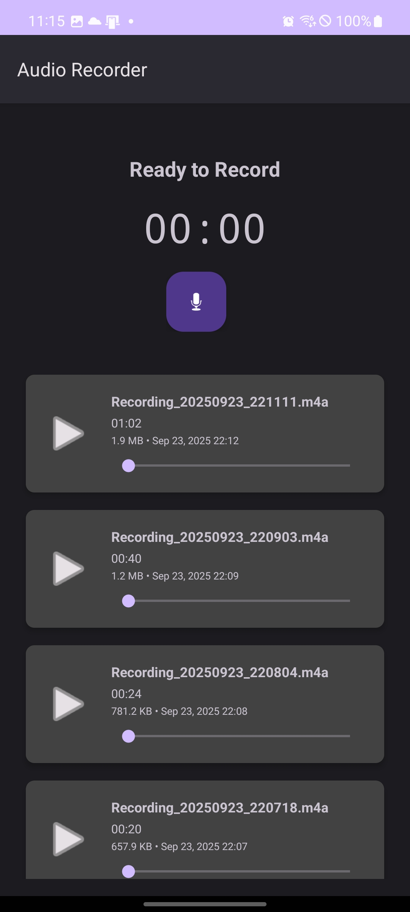

# Audio Recorder Android App

A simple yet functional audio recording application for Android, built with Java.

## Features

- **Audio Recording:** Easily record audio with a single tap.
- **Background Service:** Recording continues in the background using a foreground service, even if the app is minimized.
- **Playback Controls:** Play, pause, and seek through your recordings.
- **File Management:** List, rename, delete, and share your audio files.
- **Live Waveform:** See a live visualization of the audio waveform while recording.
- **Pause & Resume:** Pause the recording and resume it later.

## Tech Stack

- **Language:** Java
- **Platform:** Android
- **Core Libraries:**
  - AndroidX Libraries (AppCompat, Material Components, RecyclerView, Lifecycle)
  - `Media3 ExoPlayer` for robust audio playback.
- **Permissions:** The app requires permissions for recording audio, accessing storage, and running a foreground service.

## How to Build

1.  Clone the repository.
2.  Open the project in Android Studio.
3.  Let Gradle sync the dependencies.
4.  Build and run the app on an Android device or emulator (API level 29 or higher).

## Permissions Used

The application requires the following permissions, which are declared in the `AndroidManifest.xml`:

- `RECORD_AUDIO`: To capture audio from the microphone.
- `FOREGROUND_SERVICE` & `FOREGROUND_SERVICE_MICROPHONE`: To allow the recording service to run in the background.
- `POST_NOTIFICATIONS`: To display a persistent notification for the foreground service.
- `WAKE_LOCK`: To keep the processor from sleeping during recording.
- `READ_MEDIA_AUDIO` / `READ_EXTERNAL_STORAGE`: To read the saved recording files.
- `WRITE_EXTERNAL_STORAGE`: To save the recording files (for older Android versions).

## Screenshots

|                                                        |                                                        |                                                        |
| :----------------------------------------------------: | :----------------------------------------------------: | :----------------------------------------------------: |
|   |   |   |
|   |   |   |
